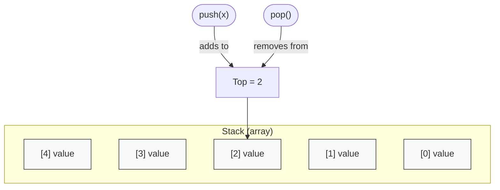

# Stack with Array

This folder contains a simple C implementation of a stack data structure using an array.

## Files

- `main.c` - Demonstrates stack usage: creating a stack, pushing and popping values, displaying contents, and peeking at the top value.
- `header.h` - Contains stack structure definitions, status enum, and function declarations.
- `Stack.c` - Implements stack operations: create, push, pop, peek, display, and delete.

## Features

- Fixed-size stack backed by a dynamically allocated array
- `push` and `pop` operations
- `peek` to inspect the top element
- `display` to show stack contents
- `deleteStack` to free allocated memory

## Block Diagram

The diagram below highlights the fixed-size array-backed stack implemented in this project, showing the array slots, the `top` pointer, and the `push`/`pop` operations.



## Build and Run

Use a C compiler such as `gcc`:

```sh
gcc main.c Stack.c -o stack
./stack
```

## Notes

- The stack capacity is set to `5` in `main.c`.
- The implementation uses `top = -1` for an empty stack.
- `Status` returns `SUCCESS` or `FAILURE` for stack operations.
